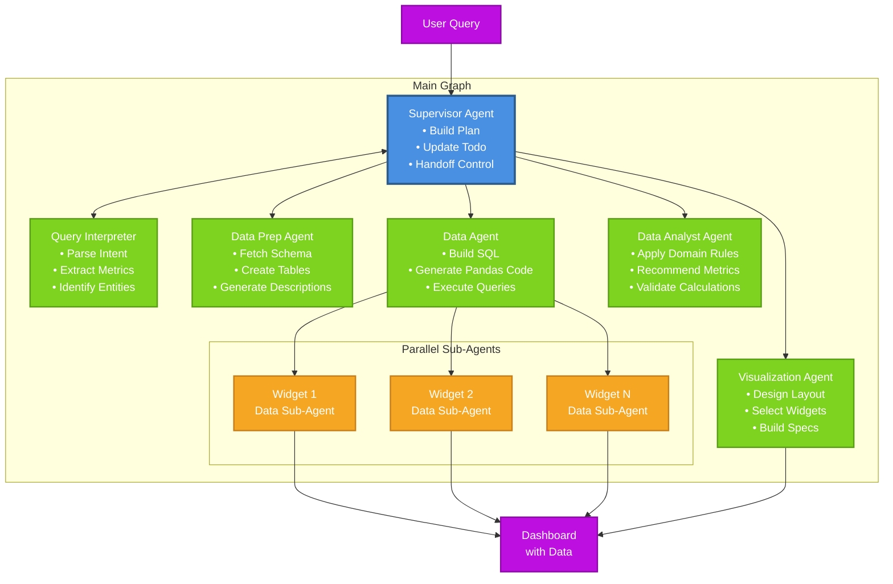

# Multi Agent BI - Agent Architecture

## Resources

- Claude code SDK doc https://docs.anthropic.com/en/docs/claude-code/sdk
- Claude code SDK github https://github.com/anthropics/claude-code-sdk-python
- Langgraph multi agent:https://langchain-ai.github.io/langgraph/agents/multi-agent/?h=multi
- Langgraph guides doc: https://langchain-ai.github.io/langgraph/guides/
- Langgraph streaming https://langchain-ai.github.io/langgraph/how-tos/streaming/#supported-stream-modes

## Overview

Hierarchical multi-agent system following LangGraph's [hierarchical architecture pattern](https://langchain-ai.github.io/langgraph/concepts/multi_agent/#hierarchical). All agents communicate through shared LangGraph state, with the Supervisor orchestrating the workflow.

## System Architecture



## Global State Schema

```python
from typing import TypedDict, List, Dict, Optional
from pydantic import BaseModel

class Task(BaseModel):
    id: str
    description: str
    agent: str
    status: str  # "pending", "in_progress", "completed", "failed"
    dependencies: List[str]
    result: Optional[Dict]

class QueryInterpretation(BaseModel):
    intent: str  # "create_dashboard", "edit_widget", "add_metric", etc.
    dashboard_type: str  # "watchlist_summary", "portfolio_analysis", etc.
    metrics: List[str]  # ["price", "returns", "volume", "sentiment"]
    entities: List[str]  # Company names or portfolio identifiers
    time_filters: Optional[Dict]  # {"start": "2024-01-01", "period": "1Y"}
    interaction_requirements: List[str]  # ["portfolio_overview", "company_drill_down"]

class WidgetDataRequirements(BaseModel):
    widget_id: str
    widget_type: str  # "line_chart", "table", "kpi_card", "heatmap"
    data_format: str  # "time_series", "snapshot", "aggregated"
    main_columns: List[str]
    additional_columns: List[str]
    aggregation_level: str  # "daily", "company", "portfolio"
    filters: Optional[Dict]

class WidgetSpec(BaseModel):
    widget_id: str
    widget_type: str
    config: Dict  # JSON spec for visualization library
    data_requirements: WidgetDataRequirements
    position: Dict  # {"x": 0, "y": 0, "w": 6, "h": 4}

class GlobalState(TypedDict):
    # Core conversation state
    user_query: str
    session_id: str
    conversation_history: List[Dict]

    # Interpretation and planning
    query_interpretation: Optional[QueryInterpretation]
    todo_plan: List[Task]
    current_task: Optional[str]

    # Dashboard state
    dashboard_layout: Dict
    widget_specs: Dict[str, WidgetSpec]
    widget_data_queries: Dict[str, Dict]  # {widget_id: {sql: str, pandas: str}}

    # Data state
    available_tables: List[Dict]  # Schema information
    created_subtables: List[str]
    data_descriptions: Dict[str, str]

    # Execution state
    errors: List[Dict]
    warnings: List[Dict]
```

## Agent Specifications

### 1. Supervisor Agent

**Purpose**: Orchestrates the entire workflow, maintains the plan, and routes to appropriate agents.

**Tool Functions**:

```python
class BuildPlanInput(BaseModel):
    query_interpretation: QueryInterpretation
    current_state: Optional[Dict]  # Existing dashboard state
    conversation_history: List[Dict]

class BuildPlanOutput(BaseModel):
    todo_list: List[Task]
    initial_handoff: str  # Agent to start with
    reasoning: str

class UpdateTodoInput(BaseModel):
    task_id: str
    status: str
    result: Optional[Dict]
    new_tasks: Optional[List[Task]]

class HandoffInput(BaseModel):
    target_agent: str
    task: Task
    context: Dict
```

**Capabilities**:

- Analyze query complexity and create execution plan
- Manage task dependencies and parallel execution
- Handle errors and create recovery tasks
- Maintain conversation context
- Decide when to skip agents based on query type

### 2. Query Interpreter Agent

**Purpose**: Understands user intent and extracts structured information from natural language.

**Tool Functions**:

```python
class InterpretQueryInput(BaseModel):
    user_query: str
    conversation_history: List[Dict]

class QueryInterpretation(BaseModel):
    intent: str  # "create_dashboard", "edit_widget", "add_metric", etc.
    dashboard_type: str  # "watchlist_summary", "portfolio_analysis", etc.
    metrics: List[str]  # ["price", "returns", "volume", "sentiment"]
    entities: List[str]  # Company names or portfolio identifiers
    time_filters: Optional[Dict]  # {"start": "2024-01-01", "period": "1Y"}
    interaction_requirements: List[str]  # ["portfolio_overview", "company_drill_down"]


```

**Capabilities**:

- Parse natural language for financial metrics and entities
- Identify dashboard interaction patterns
- Extract temporal expressions
- Suggest relevant additional data points
- Handle ambiguous queries with clarification

### 3. Data Prep Agent

**Purpose**: Manages data source connections and schema preparation.

**Tool Functions**:

```python
class FetchSchemaInput(BaseModel):
    data_source: str  # "postgres", "snowflake", "mcp_server_x"
    connection_params: Dict
    table_patterns: Optional[List[str]]

class FetchSchemaOutput(BaseModel):
    tables: List[Dict]  # Schema information
    relationships: List[Dict]  # Foreign keys, joins
    metadata: Dict

class CreateTableInput(BaseModel):
    table_name: str
    schema: Dict
    source_query: Optional[str]
    is_temporary: bool

class CreateDescriptionInput(BaseModel):
    tables: List[str]
    include_samples: bool
    business_context: str

class CreateDescriptionOutput(BaseModel):
    descriptions: Dict[str, str]
    column_semantics: Dict[str, Dict]  # Column meanings
    suggested_joins: List[Dict]
```

**Capabilities**:

- Connect to multiple data sources via MCP
- Fetch and analyze database schemas
- Create optimized tables for dashboard needs
- Generate comprehensive data documentation
- Identify data quality issues

### 4. Data Agent

**Purpose**: Generates and executes data queries for widgets using Claude Code SDK.

**Tool Functions**:

```python
class BuildDataForWidgetInput(BaseModel):
    widget_id: str
    data_requirements: WidgetDataRequirements
    available_tables: List[Dict]
    business_rules: Dict  # Domain-specific calculations

class BuildDataForWidgetOutput(BaseModel):
    widget_id: str
    sql_query: str
    pandas_code: str
    subtables_created: List[str]
    estimated_rows: int
    execution_time_estimate: float
```

**Sub-Agent Architecture**:

- Spawns parallel sub-agents for each widget
- Each sub-agent uses Claude Code SDK for code generation
- Handles complex financial calculations
- Optimizes queries for performance

**Capabilities**:

- Generate optimized SQL queries
- Create pandas transformations for complex logic
- Handle time-series data properly
- Apply financial calculation rules
- Manage data dependencies between widgets

### 5. Visualization Agent

**Purpose**: Designs dashboard layouts and generates widget specifications.

**Tool Functions**:

```python
class BuildWorkflowInput(BaseModel):
    query_interpretation: QueryInterpretation
    available_widgets: List[str]
    design_principles: Dict

class BuildWorkflowOutput(BaseModel):
    workflow_type: str  # "drill_down", "comparative", "temporal"
    interaction_patterns: List[Dict]
    widget_relationships: Dict  # How widgets connect

class BuildWidgetSpecInput(BaseModel):
    widget_type: str
    data_sample: Dict  # Sample of actual data
    display_requirements: Dict
    position_hint: Optional[Dict]

class BuildLayoutInput(BaseModel):
    widget_specs: List[WidgetSpec]
    workflow: Dict
    screen_constraints: Dict

class BuildLayoutOutput(BaseModel):
    layout: Dict  # Grid positions
    responsive_rules: List[Dict]
    interaction_bindings: Dict
```

**Capabilities**:

- Select appropriate widget types based on data
- Design intuitive dashboard layouts
- Create interactive workflows
- Apply financial visualization best practices
- Generate responsive designs

### 6. Data Analyst Agent (Optional Enhancement)

**Purpose**: Applies domain expertise to enhance data selection and calculations.

**Tool Functions**:

```python
class AnalyzeMetricsInput(BaseModel):
    requested_metrics: List[str]
    entity_type: str  # "equity", "portfolio", "sector"
    use_case: str

class AnalyzeMetricsOutput(BaseModel):
    recommended_metrics: List[str]
    calculation_rules: Dict
    benchmarks: List[str]
    caveats: List[str]  # Data quality warnings
```

## Error Handling Strategy

1. **Agent-Level**: Each agent validates inputs and outputs
2. **Task-Level**: Supervisor monitors task status and retries
3. **Data-Level**: Fallback queries for missing data
4. **User-Level**: Clear error messages with suggested actions

## Performance Optimizations

1. **Parallel Execution**: Widget data processing in parallel
2. **Query Caching**: Cache frequently used queries
3. **Incremental Updates**: Only update changed widgets
4. **Smart Routing**: Skip unnecessary agents based on query type
5. **Batch Processing**: Group similar data requests
